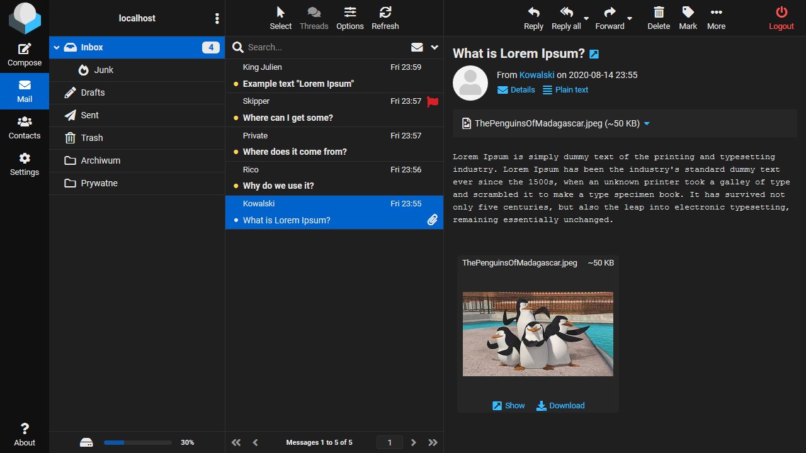
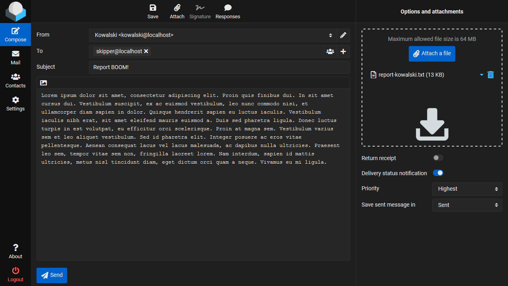
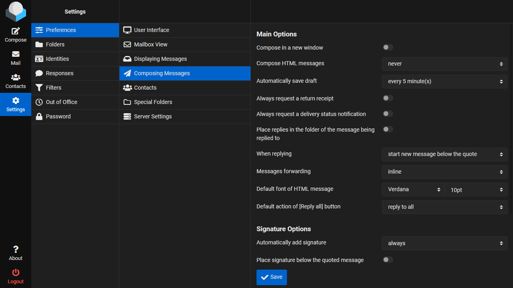
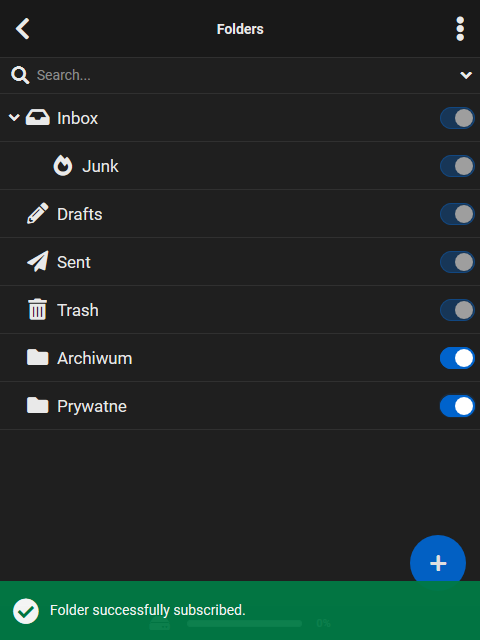

# Roundcube Elastic Dark

Dark theme for the Elastic skin.

A theme made on the version of Roundcube Webmail 1.4.5.

## Installation

* (Required) Install the extension **Stylus** for your browser: [Firefox](https://addons.mozilla.org/en/firefox/addon/styl-us/), [Opera](https://addons.opera.com/en/extensions/details/stylus/) or [Chrome](https://chrome.google.com/webstore/detail/stylus-beta/apmmpaebfobifelkijhaljbmpcgbjbdo)
* Click on one of the links below and install the style
  * [Elastic Dark RAW Minify](https://raw.githubusercontent.com/Skorpion/roundcube-elastic-dark/master/styles/main.user.css)
  * [Elastic Dark RAW Beautify](https://raw.githubusercontent.com/Skorpion/roundcube-elastic-dark/master/styles/main_doc.user.css)
* In the open window with the style installed, enter the name of your mail server
  * Edit this entry: `your_mail_server.com`
* **Save** style

## Pictures

## Links

* [Official repository Elastic](https://github.com/roundcube/elastic)
* [Official repository RoundcubeMail](https://github.com/roundcube/roundcubemail)
