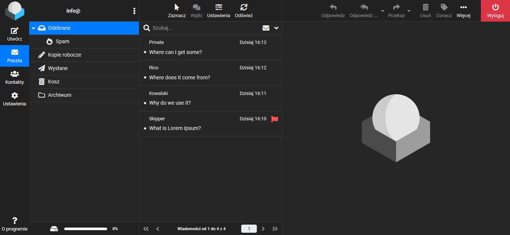
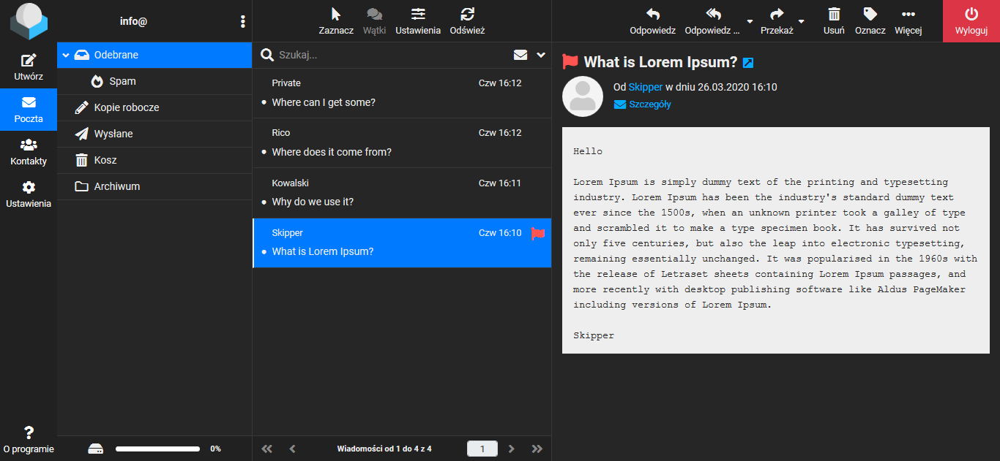

# Roundcube Elastic Dark

Ciemny motyw dla skórki Elastic.

## Instalacja

### Wymagane

* Zainstaluj rozszerzenie **Stylus** dla swojej przeglądarki: [Firefox](https://addons.mozilla.org/pl/firefox/addon/styl-us/), [Opera](https://addons.opera.com/pl/extensions/details/stylus/) lub [Chrome](https://chrome.google.com/webstore/detail/stylus-beta/apmmpaebfobifelkijhaljbmpcgbjbdo)

### Instalacja zalecana

* Kliknij na jeden z podanych niżej linków i zainstaluj styl
  * [Elastic Dark RAW Minify](https://raw.githubusercontent.com/Skorpion/roundcube-elastic-dark/master/styles/main.user.css)
  * [Elastic Dark RAW Beautify](https://raw.githubusercontent.com/Skorpion/roundcube-elastic-dark/master/styles/main_doc.user.css)
* W otwartym oknie z zainstalowanym stylem wpisz nazwę swojego serwera pocztowego
 * Edytuj ten wpis: `your_mail_server.com/roundcube`
* **Zapisz** styl

### Instalacja opcjonalna

* Przejdź na stronę serwera swojej poczty
* Kliknij na ikonę rozszerzenia **Stylus** na pasku narzędzi
* Wybierz **Napisz styl dla**: **twój_serwer_pocztowy**
* Skopiuj kod (wybierz jedną opcje)
  * [Elastic Dark Minify](https://github.com/Skorpion/roundcube-elastic-dark/blob/master/styles/main.user.css)
  * [Elastic Dark Beautify](https://github.com/Skorpion/roundcube-elastic-dark/blob/master/styles/main_doc.user.css)
* Wklej do otwartego okna przeglądarki
* **Zapisz** nowy styl

## Informacje

* Wykonany w wersji oprogramowania Roundcube Webmail 1.4.2
* Wsparcie od rozdzielczości 770 pikseli

## Zdjęcia

## Linki

* [Oficjalne repozytorium Elastic](https://github.com/roundcube/elastic)
* [Oficjalne repozytorium RoundcubeMail](https://github.com/roundcube/roundcubemail)
